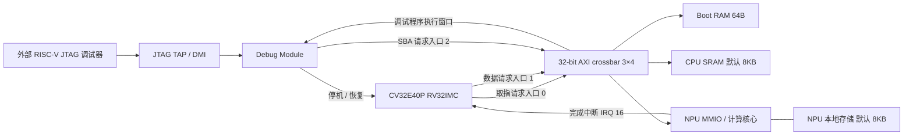

# mynpu：tiny MNIST INT8 完整 SoC

本工程在独立目录中整合了 **CV32E40P CPU、3×4 AXI crossbar、原有 JTAG/Debug Module、Boot RAM、CPU SRAM 和 INT8 CNN NPU**。默认配置是 CPU 8KB + NPU 8KB，NPU 同时计算 8 个输出通道。原始 `lab3-ST` 未修改；复用源码保存在 `third_party/lab3`，新增集成顶层是 `rtl/mynpu_soc_top.sv`。

这是已通过完整 SoC 功能仿真的 RTL 工程。NPU 存储目前是支持多个同拍访问的功能数组，尚未实现与实际单口/双口 SRAM 宏相符的访存控制，也未完成 FPGA 上板或 0.18µm 工艺综合、时序和物理签核。

## 架构



NPU 是 AXI 从设备；它从本地存储读取参数、输入和层描述符，不包含 AXI DMA master。外部可通过原有 JTAG → DMI → Debug Module SBA 加载程序和访问 NPU，保留三个 AXI 请求入口即可。

## 复现完整 SoC 仿真

需要 Python 3 和支持 SystemVerilog 类型参数的 VCS。仓库包含 CPU 程序镜像和模型数据；直接运行仿真不需要 PyTorch 或 RISC-V 编译器。

```sh
git clone https://github.com/one-bite-one-pig/mynpu.git
cd mynpu
python3 tools/verify_assets.py
python3 tools/run_sim.py --backend vcs --layout 8k --lanes 8
python3 tools/run_sim.py --backend vcs --layout 16k --lanes 16
python3 tools/run_sim.py --backend vcs --layout 8k --lanes 1
```

成功标志是 `[SOC] PASS`，脚本会检查该标志，不能只依据模拟器退出码判断成功。日志在 `build/vcs-<layout>-<lanes>/`。Vivado 2023.2 XSim 对原始 AXI 源码中的 `default disable iff` 不支持，因此当前验证使用 VCS。

完整 testbench 通过真实 CPU 指令执行以下流程：JTAG SBA 读写两块 SRAM → CPU 启动 → JTAG 停机、读取/写入/恢复 x31 → CPU 加载模型并轮询推理 → 再次推理并进入机器中断处理程序。两轮推理每层都严格对照独立 Python 整数参考，同时逐元素检查与 PyTorch FBGEMM 的差值不超过 1。

## 参数与地址

| 顶层参数 | 默认值 | 含义 |
|---|---:|---|
| `CPU_SRAM_BYTES` | 8192 | CPU 程序、数据和栈容量 |
| `NPU_SRAM_BYTES` | 8192 | NPU 参数、激活和描述符容量 |
| `NPU_LANES` | 8 | 输出通道并行数 |
| `NPU_IRQ_ID` | 16 | 接入 CV32E40P 的中断编号 |
| `CPU_INIT_FILE` | 空 | CPU RAM 仿真/FPGA 初始镜像 |
| `NPU_INIT_FILE` | 空 | 可选 NPU RAM 初始镜像 |

CPU 固件当前对应 8KB CPU SRAM、中断 16；改变这两项须同步修改 `sw/linker.ld` 和 `sw/main.c` 后重新编译。`8k/16k` 选项改变 NPU SRAM 布局，CPU SRAM 保持 8KB。`boot_ready_i=1` 允许 CPU 取指；动态加载时先保持为 0，再通过 SBA 加载并使能取指。ASIC 中 `.hex` 初始化不能替代实际程序加载。

| 地址 | 用途 |
|---|---|
| `0x0000_0000 .. 0x0000_0fff` | Debug Module 的 CPU 可见窗口 |
| `0x0001_0000 .. 0x0001_003f` | Boot RAM，跳转到 CPU SRAM |
| `0x8000_0000 .. 0x8000_1fff` | 默认 CPU SRAM |
| `0x7000_0000` | NPU CONTROL：START bit0、IRQ enable bit1、清状态 bit2 |
| `0x7000_0004` | STATUS：BUSY bit0、DONE bit1、ERROR bit2 |
| `0x7000_0010` | 本地 SRAM 中的描述符字节偏移 |
| `0x7000_0014` | 推理层数，本模型为 6 |
| `0x7000_0018` | NPU 运行周期计数 |
| `0x7000_4000` 起 | NPU SRAM 的 32-bit、小端访问窗口 |
| `0x8000_1fc0 .. 0x8000_1fff` | 自测结果 mailbox |

当前实现是两块独立的逻辑 SRAM。`SHARED_SRAM=1` 只规定 NPU BUSY 时忽略主机写本地数组，不代表 CPU 主存与 NPU 已共用一个物理 SRAM；共用物理宏需要进一步实现端口仲裁和延迟处理。

## 模型及整数运算

模型来自 [tiny_MNIST 的 pool-stride2-fp32-int8 分支](https://github.com/CatalpaEel/tiny_MNIST/tree/pool-stride2-fp32-int8)，checkpoint 存在 `model/checkpoints/model_int8.pt`。卷积的 BatchNorm 和 ReLU 已在 PyTorch 量化流程中融合。

| 层 | 输入 CHW | 输出 CHW | 核 / stride |
|---|---|---|---|
| Conv1 + ReLU | 1×28×28 | 2×14×14 | 3×3 / 2 |
| Conv2 + ReLU | 2×14×14 | 4×14×14 | 3×3 / 1 |
| Conv3 + ReLU | 4×14×14 | 8×7×7 | 3×3 / 2 |
| Conv4 + ReLU | 8×7×7 | 8×3×3 | 3×3 / 2，保留原 4×4 的左上 3×3 |
| Conv5 + ReLU | 8×3×3 | 16×3×3 | 3×3 / 1 |
| FC | 144 | 10 | 10×144 |

输入/中间值保存为 8-bit activation code，权重为 per-output-channel signed INT8；芯片不做浮点输入量化或 BatchNorm 运算。导出器预先生成 INT32 bias、每通道 Q31 multiplier 和 shift：

```text
b_int[c] = round(b_float[c] / (s_input * s_weight[c]))
acc[c]   = b_int[c] + Σ ((q_input - z_input) * q_weight[c])
M[c]     = round((s_input * s_weight[c] / s_output) * 2^31)
q_output = clamp(((acc[c] * M[c] + 2^30) >> 31) + z_output, 0, qmax)
```

ReLU 在 clamp 前将值下限设为 `z_output`。此 RTL 的半整数舍入向正无穷；它与 FBGEMM 的浮点 requant 不完全 bit-exact。当前固定向量的最终整数输出为 `[68,50,82,68,55,80,75,63,76,59]`，PyTorch 为 `[68,49,82,68,55,80,75,63,76,59]`，两者 argmax 都是 2。

当前描述符 `qmax=127`。`quint8` 本身仍允许 0..255；reduced-range observer 不能保证任意输入下所有转换后算子的输出都 ≤127。现有验证向量满足该范围，尚未做全测试集的 RTL 精度评估。更换数据分布或 qmax 后应重新做模型与 RTL 对照，不能直接把 activation 当 signed INT8 使用。

## 重新导出和编译

已实际验证的 PyTorch 版本为 2.2.2 CPU，使用 FBGEMM。更高版本应先确认旧 checkpoint 和量化 API 的兼容性。

```sh
python cnn_npu_int8/tools/export_model.py --checkpoint model/checkpoints/model_int8.pt --out-dir cnn_npu_int8/generated/8k --sram-bytes 8192 --lanes 8
python cnn_npu_int8/tools/export_model.py --checkpoint model/checkpoints/model_int8.pt --out-dir cnn_npu_int8/generated/16k --sram-bytes 16384 --lanes 16
python tools/build_firmware.py --layout 8k --gcc /path/to/riscv64-unknown-elf-gcc
python tools/build_firmware.py --layout 16k --gcc /path/to/riscv64-unknown-elf-gcc
```

编译器须支持 `-march=rv32imc_zicsr -mabi=ilp32`，匹配的 objcopy 默认从 gcc 路径推导，也可以传 `--objcopy`。固件、模型常量共约 6.3KB，另保留 1KB 栈和 64B mailbox。模型数据先在 CPU RAM 的只读区，再由 CPU 写入 NPU RAM。

详细验证数据见 [docs/verification.md](docs/verification.md)，JTAG/存储/流片边界见 [docs/integration.md](docs/integration.md)，上板指导见 [EGO1 指导](cnn_npu_int8/docs/fpga-ego1-guide.md)。
